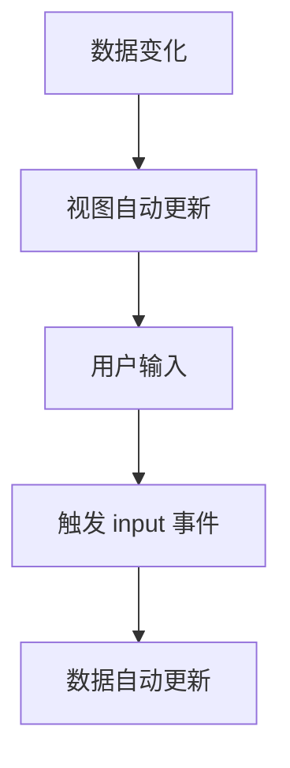

# v-model 详解

## 一、v-model 是什么？

`v-model` 是 Vue 提供的一个**双向数据绑定**的语法糖，常用于表单控件（如 input、select、textarea）上，实现数据和视图的自动同步。

**简单例子：**

```vue
<template>
  <input v-model="msg" />
  <p>{{ msg }}</p>
</template>

<script setup>
import { ref } from 'vue'
const msg = ref('hello')
</script>
```

- 当你输入内容时，`msg` 的值会自动更新。
- 当你在 JS 里修改 `msg`，input 框的内容也会自动变化。

---

## 二、v-model 的底层原理

### 1. 在 Vue2 中

- `v-model` 实际上是 `:value` + `@input` 的语法糖。

等价于：

```vue
<input :value="msg" @input="msg = $event.target.value" />
```

- `:value="msg"` 负责把数据渲染到视图
- `@input="msg = $event.target.value"` 负责把视图的变化同步到数据

### 2. 在 Vue3 中

- Vue3 的 v-model 更加灵活，支持多个 v-model，底层是 `modelValue` 和 `update:modelValue` 事件。

等价于：

```vue
<input :value="msg" @input="$emit('update:modelValue', $event.target.value)" />
```

---

## 三、自定义组件中的 v-model

### 1. Vue2 自定义组件

```vue
<MyInput v-model="msg" />

// MyInput 组件内部
props: ['value'],
methods: {
  onInput(e) {
    this.$emit('input', e.target.value)
  }
}
```

### 2. Vue3 自定义组件

```vue
<MyInput v-model="msg" />

// MyInput 组件内部
props: {
  modelValue: String
},
emits: ['update:modelValue'],
setup(props, { emit }) {
  const onInput = (e) => {
    emit('update:modelValue', e.target.value)
  }
  return { onInput }
}
```

---

## 四、v-model 的高级用法

### 1. 修饰符

- `.lazy`：失去焦点时才同步数据
- `.number`：自动将输入值转为数字
- `.trim`：自动去除首尾空格

```vue
<input v-model.lazy="msg" />
<input v-model.number="age" />
<input v-model.trim="name" />
```

### 2. 多个 v-model（Vue3）

```vue
<MyInput v-model:title="title" v-model:content="content" />
// 组件内部 props: { title: String, content: String }
// emits: ['update:title', 'update:content']
```

---

## 五、v-model 的实现流程图



---

## 六、常见问题

1. **v-model 只能用于表单吗？**

   - 不是。自定义组件也可以用，只要实现对应的 props 和事件。

2. **v-model 和 watch 有什么区别？**

   - v-model 是数据和视图的双向绑定，watch 是监听数据变化做额外处理。

3. **v-model 支持对象/数组吗？**
   - 支持，和普通数据一样。

---

## 七、总结

- v-model 是 Vue 的双向绑定语法糖
- Vue2 本质是 `:value` + `@input`
- Vue3 本质是 `modelValue` + `update:modelValue`
- 支持自定义组件、修饰符和多 v-model
- Proxy 和响应式系统保证了数据和视图的自动同步
